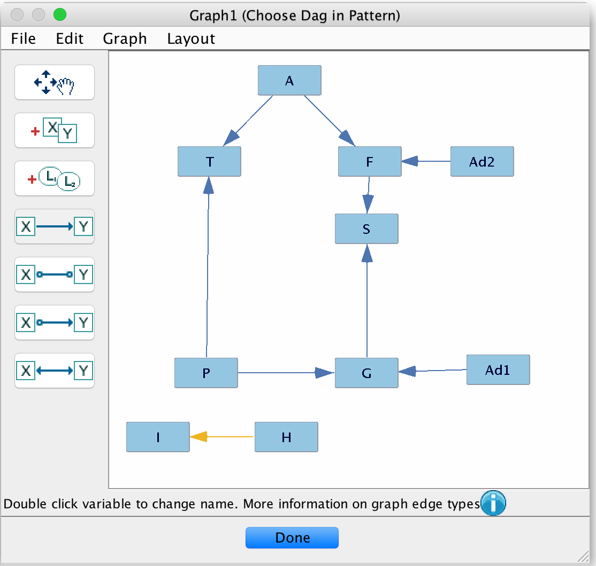

# Artificial Intelligence
## HW3: Having a Bayes Ball

### 1.

***

### 2.
First, the PC algorithm takes an undirected graph. Then, it creates directed edges. Initially, the algorithm has every edge in the network. For each pair of vertices that has an edge between it, say X and Y, and the algorithm checks if some variable Z is conditionally independent of X and Y. Each iteration of the while loop removes variables that have been found to be conditionally independent.
***

### 3.
Using the data, the algorithm was able to find dependence relationships between most variables. Th algorithm found that both *I* and *H* were conditionally independent from the rest of the variables. Additionally, the algorithm added an undirected edge between *I* and *H* because no conditional independences were found
***

### 4.
```In a small paragraph, argue for whether or not you believe this practice should be considered ethical, especially if each individual's characteristics were collected via social media. Compare this practice to targeted political advertising wherein ads are curated based on perceived in-group.```
***
